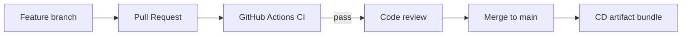

# Team Structure — SRE End Term (Group Project)

**Repository:** https://github.com/Nurbolat69/sre-end-term-microservices  
**Course:** Site Reliability Engineering — End Term Project  
**Delivery model:** Team-based development + CI/CD

## Team members & roles

| Member | Role | Responsibilities | Artifacts |
|--------|------|------------------|-----------|
| **Nurbolat69** | Team Lead / SRE Lead | Architecture, Git, CI/CD, final report | `.github/workflows/`, `docs/TEAM_REPORT.md` |
| **Member 2** | DevOps / IaC Engineer | Terraform, Ansible automation | `terraform/`, `ansible/` |
| **Member 3** | Platform Engineer | Docker Compose, Swarm, Kubernetes | `docker-compose/`, `docker-swarm/`, `kubernetes/` |
| **Member 4** | Observability Engineer | Prometheus, Grafana, SLI/SLO | `monitoring/`, `docs/SLI-SLO.md` |
| **Member 5** | Reliability Engineer | Incident drill, postmortem, runbooks | `docs/incident-*`, `scripts/demo-incident-full.ps1` |

> Replace **Member 2–5** with real names before PDF submission.

## Collaboration workflow

1. Branch from `main`: `feature/<name>-<task>`  
2. Open PR → automatic **CI** (compose, Terraform, Ansible, smoke)  
3. Peer review (min. 1 approval)  
4. Merge → **CD** packages `sre-end-term-bundle.tar.gz`

## Communication

- **Issues:** GitHub Issues for tasks (Assignment 1–6 labels)  
- **PRs:** Link issue, describe SLO/monitoring impact  
- **Incidents:** Shared runbook `docs/incident-response.md`

## RACI (key deliverables)

| Deliverable | Responsible | Accountable | Consulted | Informed |
|-------------|-------------|-------------|-----------|----------|
| Microservices deploy | Platform | SRE Lead | DevOps | All |
| SLI/SLO | Observability | SRE Lead | All | All |
| Terraform/Ansible | DevOps | SRE Lead | Platform | All |
| CI/CD pipeline | SRE Lead | SRE Lead | DevOps | All |
| Incident postmortem | Reliability | SRE Lead | Observability | All |
| REPORT PDF | SRE Lead | All | — | Instructor |
| Presentation PDF | All | SRE Lead | — | Instructor |
