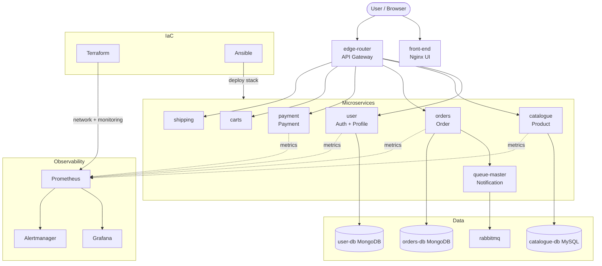

# System Architecture

## High-level diagram

## Orchestration comparison

| Capability | Docker Compose | Docker Swarm | Kubernetes |
|------------|----------------|--------------|--------------|
| Deploy speed | Fastest | Fast | Moderate |
| Replication | Manual scale | `deploy.replicas` | Deployment + HPA |
| Self-healing | restart policy | restart_policy | Pod reschedule |
| Config | env / compose files | configs (limited) | ConfigMaps / Secrets |
| Use case | Dev / demo | Small clusters | Production |

## Network (Compose)

All services share bridge network `sre-end-term-net` (`docker-compose.full.yml`).

## Request path (checkout)

1. `edge-router` → `carts` (add items)
2. `edge-router` → `orders` (create order) → `orders-db`
3. `edge-router` → `payment` (authorize)
4. `queue-master` + `rabbitmq` (async shipping notification)

## SRE control plane

| Layer | Tool | Path |
|-------|------|------|
| Provision | Terraform | `terraform/` |
| Configure & deploy | Ansible | `ansible/` |
| Observe | Prometheus + Grafana | `monitoring/` |
| Respond | Runbooks + scripts | `docs/`, `scripts/` |
